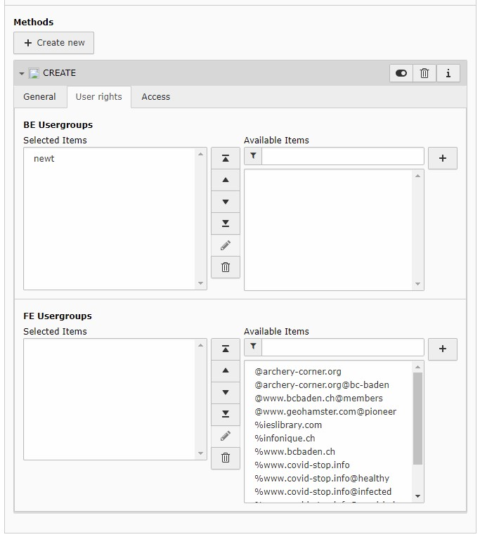

.. include:: ../Includes.txt

.. _addendpoints:

=============
Add Endpoints
=============

To add an endpoint, switch into list-view, chose the storage-page (see persistence.storagePid)

Click the plus-button, to add a new record and chose :code:`Endpoint` under :code:`Newt`

Enter the Name and the description, the Client will see this labels.

Chose the Endpoint Class from the list, if there is no entries, make sure, you have installed any Extension with at least one implementation.
Here is a list of Extensions:

.. code-block:: bash

   EXT:newt4dce
   EXT:newt4news

Some extensions need options, see the hint in the options-pallette for more informations.

If you fill in the Page UID, the records created with Newt will be stored on this page.

Add at least one Method

.. figure:: ../../Images/backend-02.jpg
   :class: with-shadow
   :alt: Methods of this endpoint

Admin-Users will see all endpoints, all other users have to be granted by BE-Groups
There is also a frontend-plugin available, if you like to grant the access to Newt for any FE-Users, you may add a FE-Group as well

When this record is saved, the endpoint is configured, and the client is able to read the configuration of this endpoint
and is able to create new records as you defined in the endpoint.

