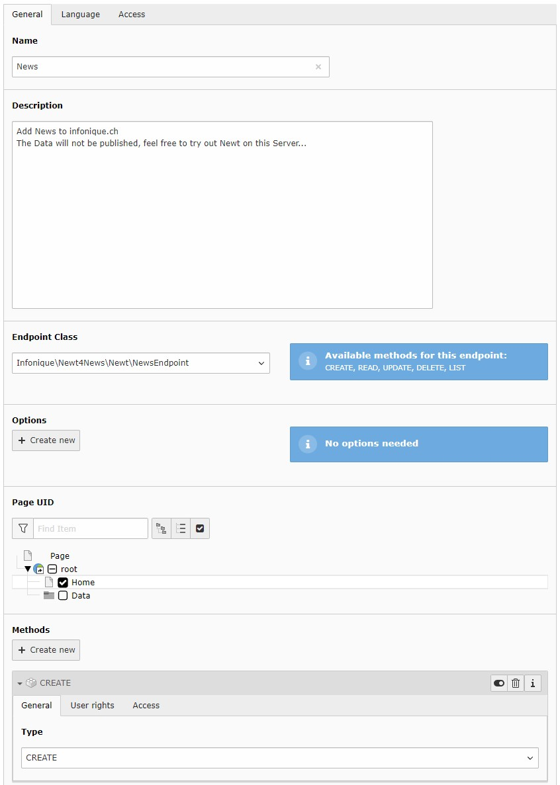

.. include:: ../Includes.txt

.. _configuration:

=============
Configuration
=============

To configurate this extension, you have to add the static template of Newt

After adding the static, you will find the constants in the Constant editor:

======================================  ==========  ==================================================================  =======================================
Property:                               Data type:  Description:                                                        Default:
======================================  ==========  ==================================================================  =======================================
settings.apiName                        string      Name of this API, this will be sent to the client, the user is
                                                    able to change it (optional)
--------------------------------------  ----------  ------------------------------------------------------------------  ---------------------------------------
settings.apiPageId                      int         Page ID to use for url-build the API-Link
                                                    Point to the page you like to use as API
                                                    Because the Extension uses a typNum, it will work with any page
                                                    This is just to have a nice URL...
--------------------------------------  ----------  ------------------------------------------------------------------  ---------------------------------------
settings.apiTypeNum                     string      Page TypeNum for the API                                            1201
--------------------------------------  ----------  ------------------------------------------------------------------  ---------------------------------------
settings.apiBaseUrl                     string      Base-URL in case you use "/" in site-configuration
                                                    For the API to work, it is important to have a full-URL
                                                    When creating URL's with the site-configuration, this is sometimes
                                                    hard to get working, in case you use "/" as base-url, place the
                                                    sites Host here (e.g.: https://example.com)
--------------------------------------  ----------  ------------------------------------------------------------------  ---------------------------------------
settings.tokenExpiration                int         Token expiration in seconds (0 = infinit)
                                                    Insert here the lifetime of the token in seconds
--------------------------------------  ----------  ------------------------------------------------------------------  ---------------------------------------
persistence.storagePid                  integer     Default storage PID
                                                    Defines the placement of the endpoint-configurations
======================================  ==========  ==================================================================  =======================================

[tsref:plugin.tx_newt]

======================================  ==========  ==================================================================  =======================================
Property:                               Data type:  Description:                                                        Default:
======================================  ==========  ==================================================================  =======================================
view.templateRootPath                   string      Defines the path where the admin-template are located               EXT:newt/Resources/Backend/Templates/
--------------------------------------  ----------  ------------------------------------------------------------------  ---------------------------------------
view.partialRootPath                    string      Defines the path where the admin-partials are located               EXT:newt/Resources/Backend/Partials/
--------------------------------------  ----------  ------------------------------------------------------------------  ---------------------------------------
view.layoutRootPath                     string      Defines the path where the admin-layout are located                 EXT:newt/Resources/Backend/Layouts/
======================================  ==========  ==================================================================  =======================================

[tsref:plugin.tx_newt_admin]

Routing example
===============

.. code-block:: yaml

   routeEnhancers:
     ApiPlugin:
       type: Extbase
       extension: Newt
       plugin: Api
       routes:
         -
           routePath: /endpoints
           _controller: 'Api::endpoints'
         -
           routePath: /create/{endpointUid}
           _controller: 'Api::create'
           _arguments:
             endpointUid: uid
         -
           routePath: /read
           _controller: 'Api::read'
         -
           routePath: /update
           _controller: 'Api::update'
         -
           routePath: /delete
           _controller: 'Api::delete'
         -
           routePath: /list
           _controller: 'Api::list'
       defaultController: 'Api::endpoints'
     PageTypeSuffix:
       type: PageType
       default: ''
       map:
         data.json: 1201

=============
Add Endpoints
=============

To add an endpoint, switch into list-view, chose the page or folder you like to add the endpoint

Click the plus-button, to add a new record and chose "Endpoint" under "Newt"

Enter the Name and the description, the Client will see this labels.

Chose the Endpoint Class from the list, if there is no entries, make shure, you have installed any Extension with at least one implementation.
Here is a list of Extensions:

.. code-block:: bash

   EXT:newt4news

If you fill in the Page UID, the records created from the client will be stored on this page.

Add at least one Method

Don't forget to add backend users to this method.

When this record is saved, the endpoint is configured, and the client is able to read the configuration of this endpoint
And is able to create new records as you defined in the endpoint.

