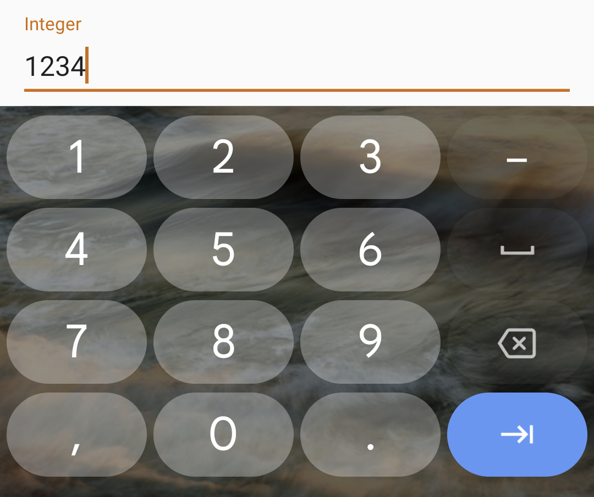
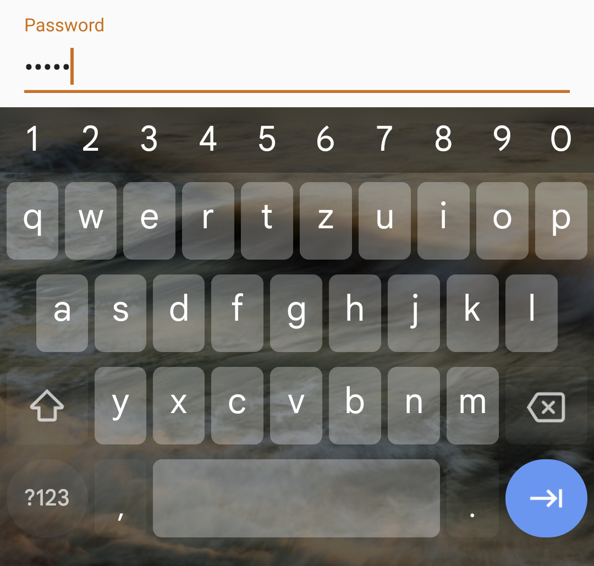
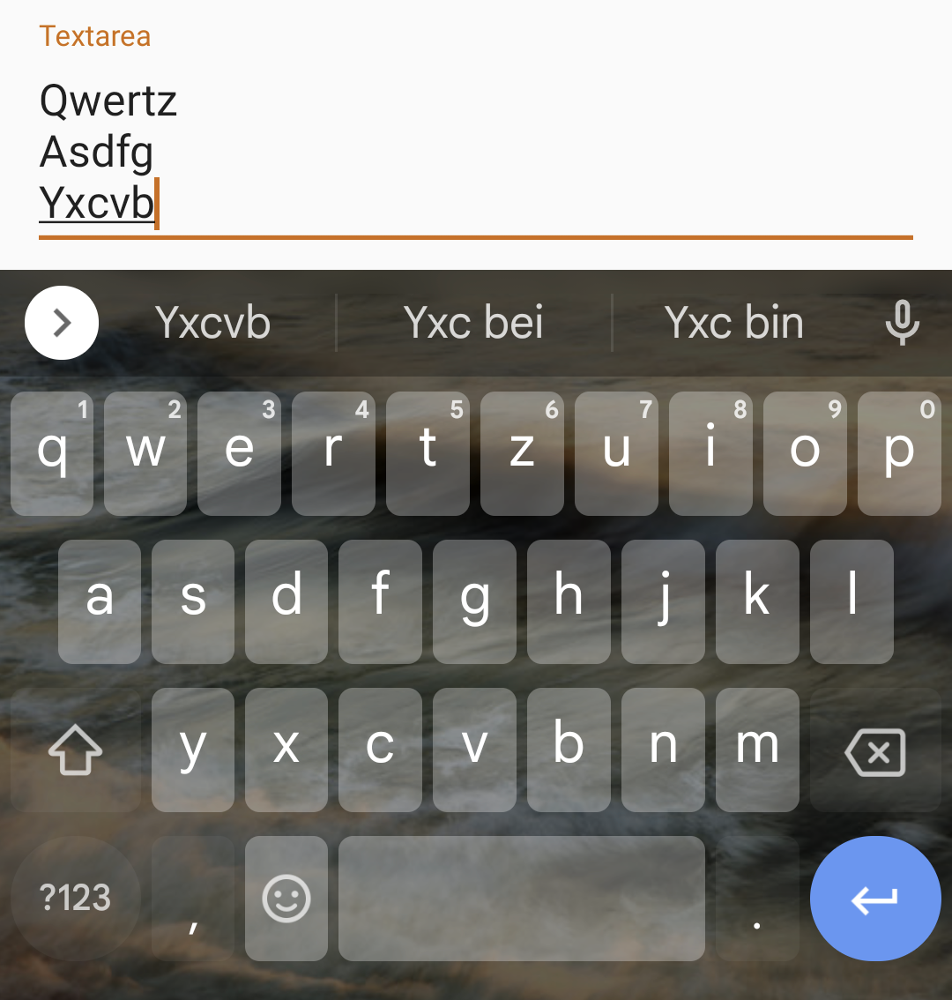
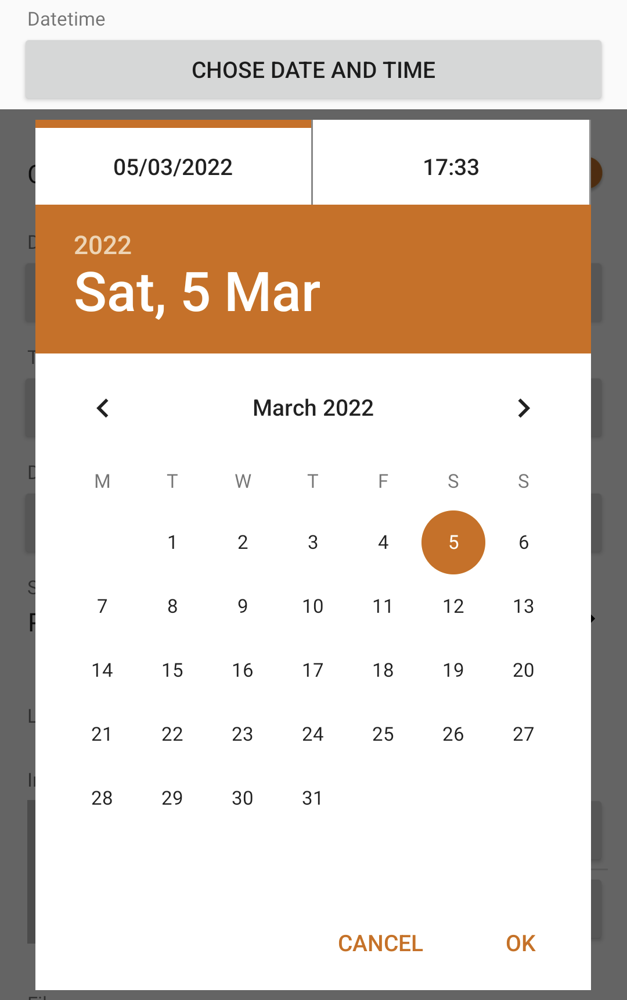
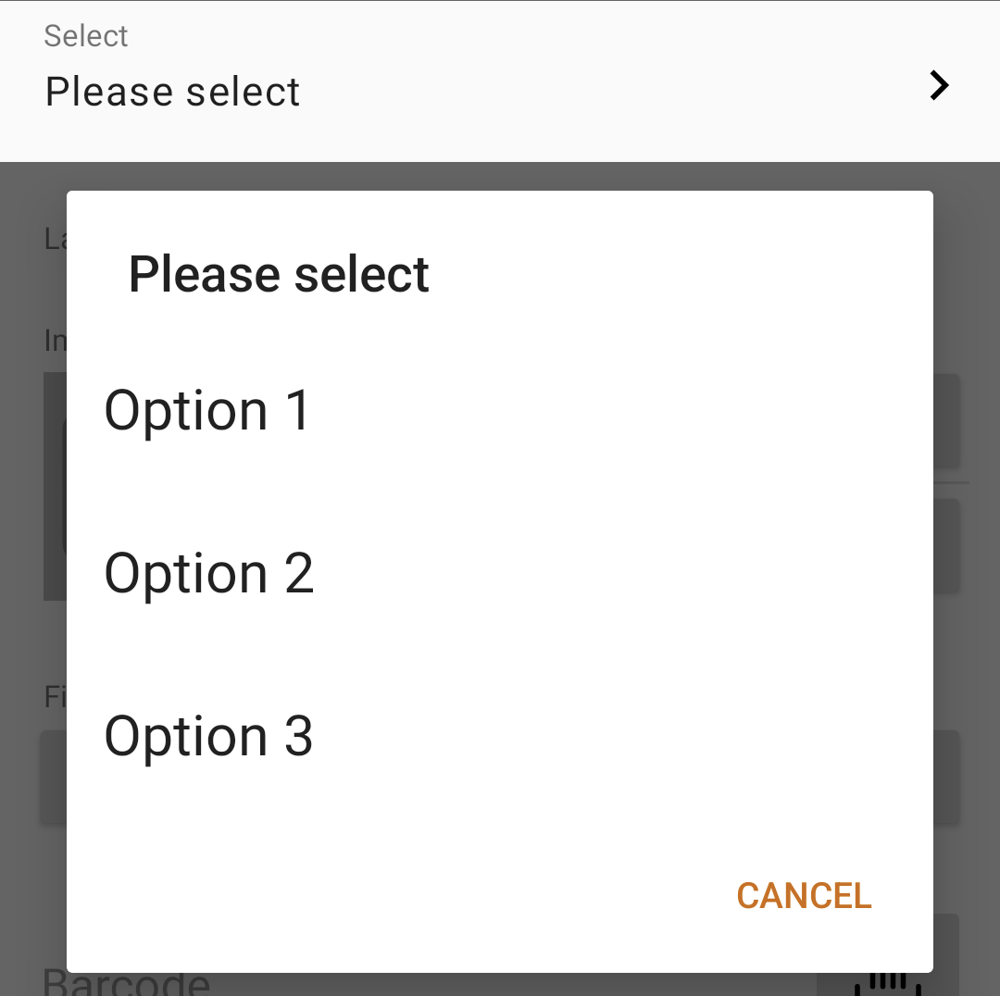
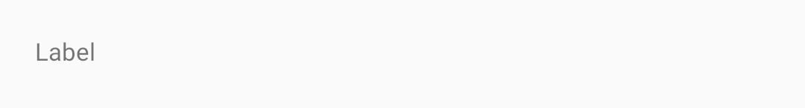
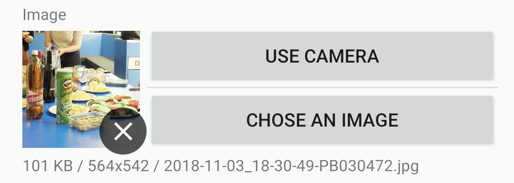
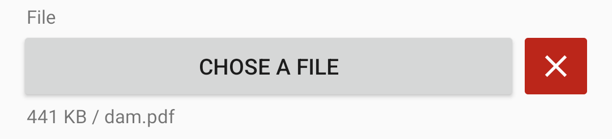

.. include:: ../Includes.txt

.. _fields:

======
Fields
======

Here's an example of the method "getAvailableFields"

.. code-block:: php

    class MyEndpoint implements \Infonique\Newt\NewtApi\EndpointInterface
    {
        public function getAvailableFields(): array
        {
            $istopnews = new Field();
            $istopnews->setName("istopnews");
            $istopnews->setLabel("Top News");
            $istopnews->setType(FieldType::CHECKBOX); // Field CHECKBOX

            $title = new Field();
            $title->setName("title");
            $title->setLabel("Title");
            $title->setType(FieldType::TEXT); // Field TEXT

            $image = new Field();
            $image->setName("image");
            $image->setLabel("Image");
            $image->setType(FieldType::IMAGE); // Field IMAGE

            return [
                $istopnews,
                $title,
                $image,
            ];
        }
    }

As you can see, you define your fields and then return theme as an array.

Here are all current available field-types:

TEXT
----
Simple Text-Field, single line

.. code-block:: php

    $text = new Field();
    $text->setName("text");
    $text->setLabel("Text");
    $text->setType(FieldType::TEXT);

:Return value:
    String

HIDDEN
------
Hidden field, this can be used as passthrough value

.. code-block:: php

    $hidden = new Field();
    $hidden->setName("hidden");
    $hidden->setValue("hidden-value");
    $hidden->setType(FieldType::HIDDEN);

:Return value:
    String

INTEGER
-------
Field to enter a number (no text)

.. code-block:: php

    $integer = new Field();
    $integer->setName("integer");
    $integer->setLabel("Integer");
    $integer->setType(FieldType::INTEGER);

:Return value:
    Integer as String

DECIMAL
-------
Field to enter a decimal (no text)

.. code-block:: php

    $decimal = new Field();
    $decimal->setName("decimal");
    $decimal->setLabel("Decimal");
    $decimal->setType(FieldType::DECIMAL);

.. figure:: ../Images/Screenshot_DECIMAL.png
    :class: with-shadow
    :width: 600px
    :alt: Decimal-Field

:Return value:
    Float as String

PASSWORD
--------
Works like any other password-field

.. code-block:: php

    $password = new Field();
    $password->setName("password");
    $password->setLabel("Password");
    $password->setType(FieldType::PASSWORD);

:Return value:
    String

TEXTAREA
--------
Multiline text-area

.. code-block:: php

    $textarea = new Field();
    $textarea->setName("textarea");
    $textarea->setLabel("Textarea");
    $textarea->setType(FieldType::TEXTAREA);

:Return value:
    String

CHECKBOX
--------
A checkbox to select on/off values

.. code-block:: php

    $checkbox = new Field();
    $checkbox->setName("checkbox");
    $checkbox->setLabel("Checkbox");
    $checkbox->setType(FieldType::CHECKBOX);

:Return value:
    String (1=on / 0=off)

DATE
----
Date picker to chose from a mini-calendar

.. code-block:: php

    $date = new Field();
    $date->setName("date");
    $date->setLabel("Date");
    $date->setType(FieldType::DATE);

:Return value:
    String (eg.: 2022-03-05)

TIME
----
Time picker to chose a time

.. code-block:: php

    $time = new Field();
    $time->setName("time");
    $time->setLabel("Time");
    $time->setType(FieldType::TIME);

:Return value:
    String (eg.: 21:12)

DATETIME
--------
Combined Date-Time picker

.. code-block:: php

    $datetime = new Field();
    $datetime->setName("datetime");
    $datetime->setLabel("Datetime");
    $datetime->setType(FieldType::DATETIME);

:Return value:
    String (eg.: 2022-03-05 21:12)

SELECT
------
Select a velue from a list

.. code-block:: php

    $select = new Field();
    $select->setName("select");
    $select->setLabel("Select");
    $select->setType(FieldType::SELECT);
    foreach (["Option 1", "Option 2", "Option 3"] as $key => $val) {
        $item = new FieldItem($key, $val);
        $select->addItem($item);
    }

.. code-block:: php
    // Optional: in case of multiselect
    $select->setCount(2); // Count of max values

:Return value:
    String

LABEL
-----
Will only display a label, you can use this field for hints

.. code-block:: php

    $label = new Field();
    $label->setName("label");
    $label->setLabel("Label");
    $label->setType(FieldType::LABEL);

:Return value:
    none

IMAGE
-----
Te image-picker can be triggered from gallery or from the camera

.. code-block:: php

    $image = new Field();
    $image->setName("image");
    $image->setLabel("Image");
    $image->setType(FieldType::IMAGE);

:Return value:
    Binary as Base64String

FILE
----
Add files as attachement

.. code-block:: php

    $file = new Field();
    $file->setName("file");
    $file->setLabel("File");
    $file->setType(FieldType::FILE);

:Return value:
    Binary as Base64String

BARCODE
-------
Scan for barcodes: Code128, Code39, EAN13 or EAN8

.. code-block:: php

    $barcode = new Field();
    $barcode->setName("barcode");
    $barcode->setLabel("Barcode");
    $barcode->setType(FieldType::BARCODE);

:Return value:
    String

RATING
------
Shows a rating field with an count of stars

.. code-block:: php

    $rating = new Field();
    $rating->setName("rating");
    $rating->setLabel("Rating");
    $rating->setType(FieldType::RATING);
    $rating->setCount(6); // Count of stars

:Return value:
    Percentag of the rating as String (all stars = 100% / 1 Star = (100/n)%)

SIGNATURE
---------
The signatur field opens a canvas, to paint on

.. code-block:: php

    $signatur = new Field();
    $signatur->setName("signatur");
    $signatur->setLabel("Signatur");
    $signatur->setType(FieldType::SIGNATURE);

:Return value:
    Binary as Base64String (PNG-Image)

QRCODE
------
Scan QR-Codes and use the content

.. code-block:: php

    $qrcode = new Field();
    $qrcode->setName("qrcode");
    $qrcode->setLabel("QR-Code");
    $qrcode->setType(FieldType::QRCODE);

.. figure:: ../Images/Screenshot_QRCODE.png
    :class: with-shadow
    :width: 600px
    :alt: QR-Code-Field

:Return value:
    String

LOCATION
--------
Mini-Map to chose the current-location of the user

.. code-block:: php

    $location = new Field();
    $location->setName("location");
    $location->setLabel("Location");
    $location->setType(FieldType::LOCATION);

:Return value:
    String (lat,lng,accuracy)

