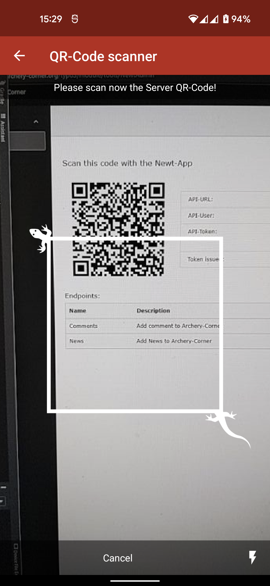
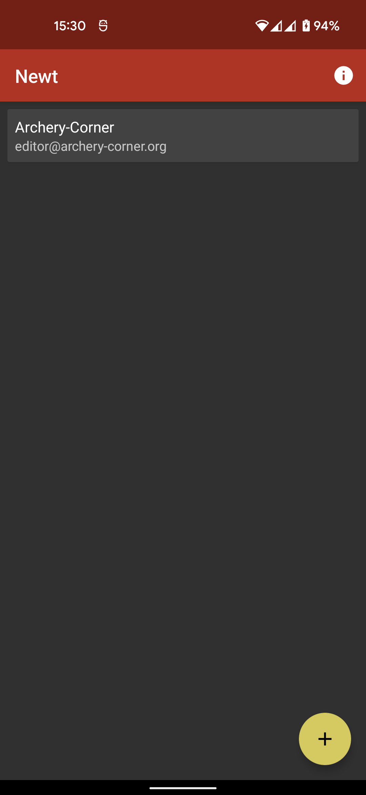
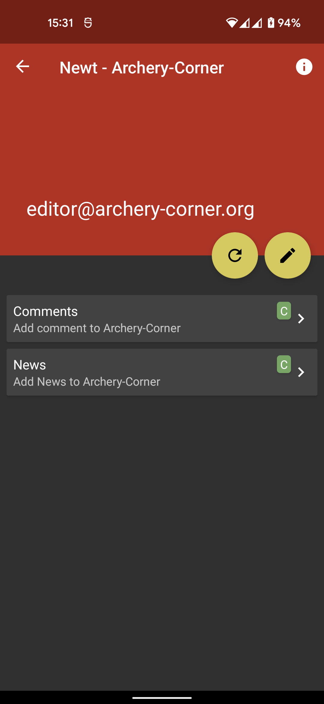
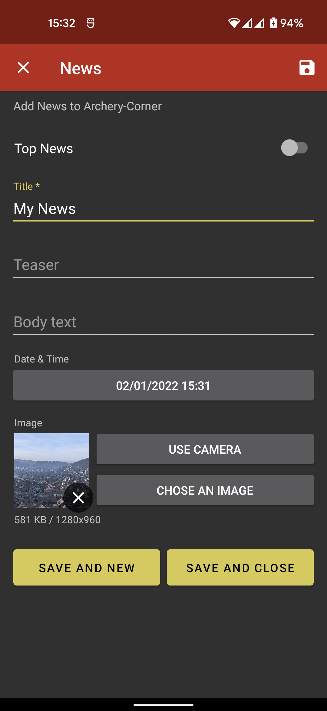

.. include:: ../Includes.txt

.. _for-editors:

===========
For Editors
===========

An editor can only open the Newt module in the backend.

There the editor will find the QR-Code, which he can scan with the Newt app.

After the configuration has been created, the editor receives a list of the configured endpoints in the app.

He can then use these endpoints as long as the token is valid.

Examples
========

.. _editor-faq:

FAQ
===

Nothing to display
