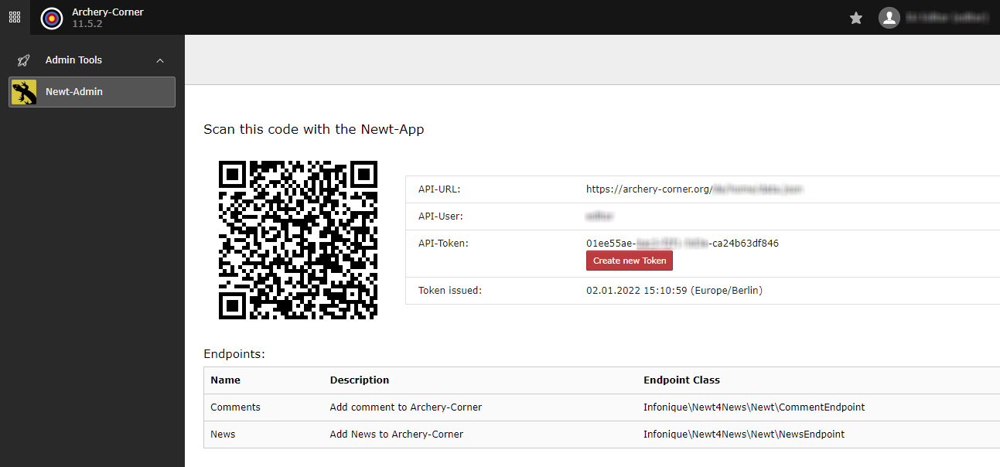

.. include:: ../Includes.txt

.. _introduction:

============
Introduction
============

.. _what-it-does:

What does it do?
================

The plugin allows you to implement the Newt-API into your TYPO3 installation.

Newt is a mobile-app available for free to manage Data on any server (not only TYPO3)

With this extension you are able to create Endpoints for the app and grant the access to your backend-users individually

The main goal is to insert data without login into TYPO3 and provide a unified UI on a native-app

The extension creats a QR-Code, which can be scanned with the Newt-App to create fast and easy configuration.

.. _screenshots:

Screenshots
===========

